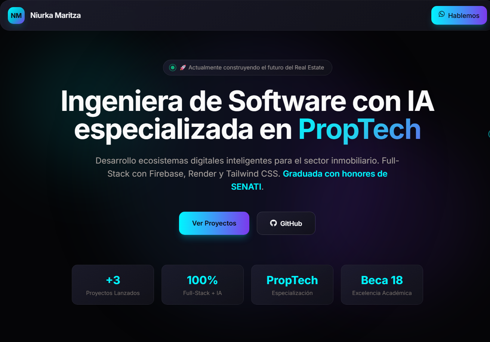

# 💼 Portafolio Profesional - Niurka Guevara

<div align="center">

[](https://niurka77.github.io/portafolio/)
[](https://github.com/Niurka77)
[]



</div>

---

## 👩‍💻 Sobre mí

Soy **Ingeniera de Software con enfoque en Inteligencia Artificial**, apasionada por el desarrollo de soluciones tecnológicas modernas en el sector **PropTech**.

Me enfoco en crear aplicaciones **funcionales, escalables y visualmente atractivas**, combinando diseño moderno con lógica sólida.

---

## ✨ Características del Portafolio

* 🌙 **Diseño oscuro moderno** con estilo neón (cyan + morado)
* 📱 **Responsive total** (mobile, tablet, desktop)
* 🎨 **Animaciones avanzadas** (glassmorphism, hover effects, transiciones suaves)
* 🖼️ **Galerías interactivas** con slider + lightbox
* 📩 **Formulario funcional** sin backend (FormSubmit)
* 🔍 **Optimización SEO**

---

## 🛠️ Tecnologías

<div align="center">


</div>

---

## 🚀 Proyectos Destacados

### 🏢 Ecosistema Inmobiliario T&F

Plataforma PropTech con dashboards y app para asesores e inversionistas.

### 🛠️ H&C Ferromateriales

Sistema ERP para control de inventario, ventas y gestión comercial.

### 🎮 Mundo Virtual Interactivo

Videojuego 3D desarrollado con JavaScript y Three.js.

---

## 📂 Estructura del Proyecto

```bash
portafolio/
├── index.html
├── logo.ico
├── *.png
└── README.md
```

---

## ⚙️ Uso Local

```bash
git clone https://github.com/niurka77/portafolio.git
cd portafolio
```

Abre `index.html` en tu navegador 🚀

---

## 📬 Contacto

<div align="center">

📧 **Correo:** [maritzaguevaramarrujo@gmail.com](mailto:maritzaguevaramarrujo@gmail.com)
📱 **WhatsApp:** +51 906 877 812
💼 **LinkedIn:** Niurka Maritza Guevara Marrujo

</div>

---

## ⭐ Extra

Si te gusta este proyecto, ¡dale una estrella ⭐ en GitHub!

</div>
