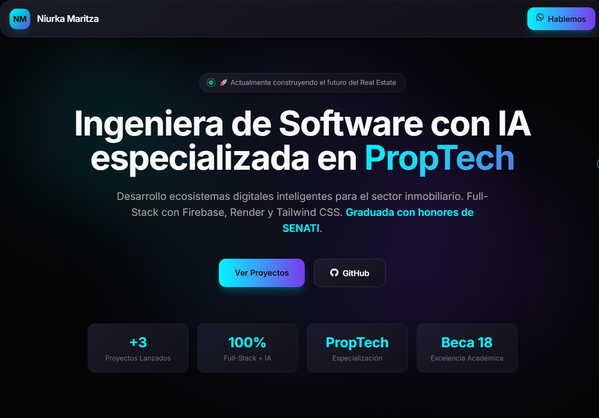

# 💼 Portafolio Profesional - Niurka Guevara

<div align="center">

[](https://niurka77.github.io/portafolio/)
[](https://github.com/Niurka77)
[]



</div>

---

## 👩‍💻 Sobre mí

Soy **Ingeniera de Software con enfoque en Inteligencia Artificial**, apasionada por el desarrollo de soluciones tecnológicas modernas en el sector **PropTech**.

Me enfoco en crear aplicaciones **funcionales, escalables y visualmente atractivas**, combinando diseño moderno con lógica sólida.

---

## ✨ Características del Portafolio

* 🪟 **Niurka OS**: portafolio interactivo estilo Windows antiguo (ventanas arrastrables, minimizables, apilables)
* 📁 **Escritorio explorable** con iconos que abren ventanas y menú Inicio
* 🎮 **Videojuego Bird Branches** jugable directamente desde una ventana
* 🏰 **Crónicas del Castillo** jugable online: dark fantasy de combate por ritmo en Canvas puro
* 🌈 **Paleta pastel** y diseño dinámico con personalidad
* 🖼️ **Galerías** de proyectos con lightbox y touch support
* 📜 **23 certificados verificables** enlazados a una carpeta pública de Google Drive
* 📄 **Documentos descargables**: CV, constancias de trabajo y certificado de inglés
* 📩 **Formulario de contacto** con apertura directa por email
* 📱 **Responsive total**

---

## 🛠️ Tecnologías

<div align="center">


</div>

---

## 🚀 Proyectos Destacados

### 🏢 Ecosistema Inmobiliario T&F

Plataforma PropTech con dashboards y app para asesores e inversionistas.

### 🛠️ H&C Ferromateriales

Sistema ERP para control de inventario, ventas y gestión comercial.

### 🎮 Mundo Virtual Interactivo

Videojuego 3D desarrollado con JavaScript y Three.js.

### 🐦 Bird Branches

Relajante juego de rompecabezas donde ordenas pájaros por colores hasta completar las ramas del bosque.
**Juega gratis:** [bird-branches.vercel.app](https://bird-branches.vercel.app/)

### 🏰 Crónicas del Castillo

Juego **dark fantasy de combate por ritmo** en HTML5 Canvas puro: sube un castillo maldito, pelea al compás de la música, bloquea, enrágate y derrota al jefe final.
**Juega gratis:** [cronicas-del-castillo.vercel.app](https://cronicas-del-castillo.vercel.app/)
**Código:** [github.com/Niurka77/cronicas-del-castillo](https://github.com/Niurka77/cronicas-del-castillo)

---

## 📂 Estructura del Proyecto

```bash
portafolio/
├── index.html
├── logo.ico
├── *.png
├── assets/
│   ├── data/certs.js
│   └── img/foto-niurka.jpg
├── documentos/
│   ├── CV_MaritzaGuevara Marrujo.docx
│   ├── constancias de trabajo.pdf
│   └── certificado de ingles.pdf
└── README.md
```

---

## ⚙️ Uso Local

```bash
git clone https://github.com/niurka77/portafolio.git
cd portafolio
```

Abre `index.html` en tu navegador 🚀

---

## 📬 Contacto

<div align="center">

📧 **Correo:** [maritzaguevaramarrujo@gmail.com](mailto:maritzaguevaramarrujo@gmail.com)
📱 **WhatsApp:** +51 906 877 812
💼 **LinkedIn:** Niurka Maritza Guevara Marrujo

</div>

---

## ⭐ Extra

Si te gusta este proyecto, ¡dale una estrella ⭐ en GitHub!

</div>
